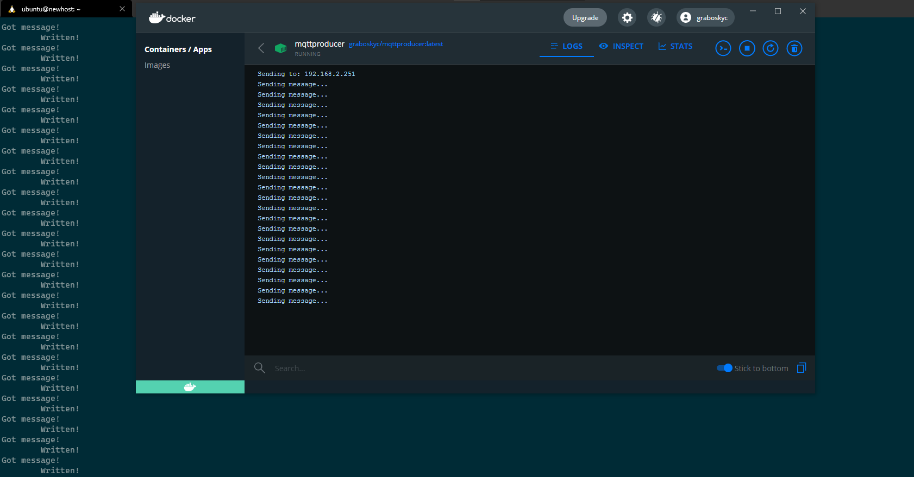
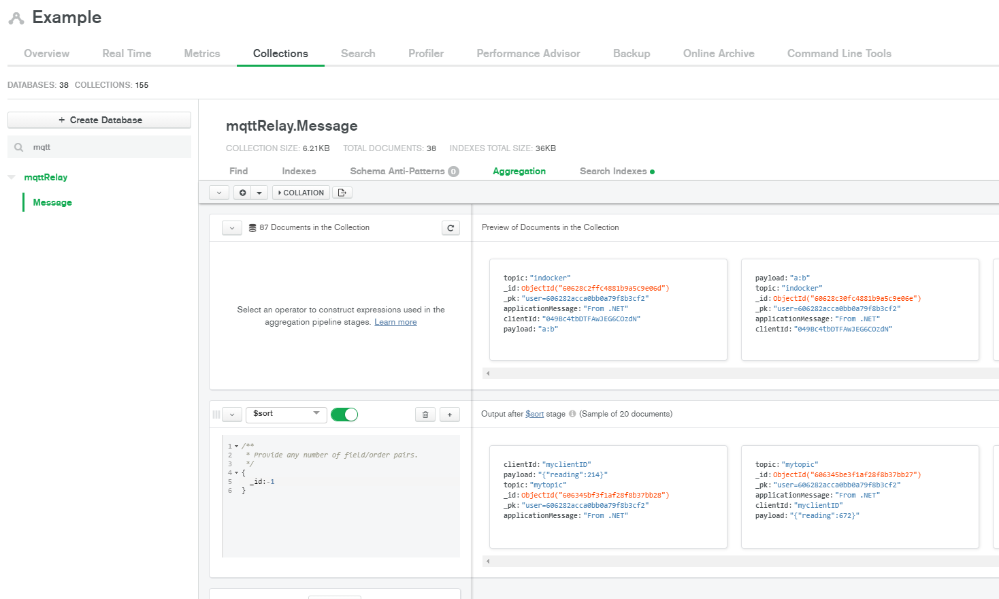

# MQTT Producer

Simple MQTT Producer meant to be used in conjunction with [MQTTtoRealm](https://github.com/graboskyc/MQTTtoRealm)

## Use

* git clone this repo
* edit `.env` for your setup
* run the `./build.sh` script to start the container

## Monitoring
* Attach to the container running the MQTTtoRealm
* Attach to the container running MQTTProducer
* You should see that each thing sent by the producer to show up in the broker
* If you Open MongoDB Atlas, you should see records being inserted

